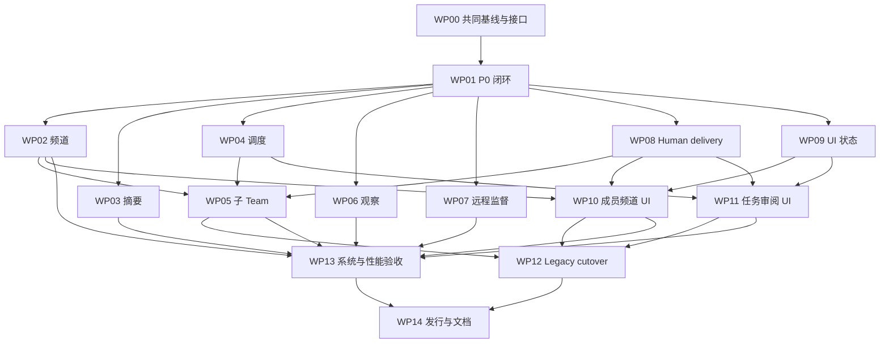

# Native multi-agent 继续开发与并行分工计划

**2026-09-06 执行优先级调整：用户要求尽快开发，优先实现功能 gap。** 独立功能开发不再等待 P0 全覆盖或完整故障矩阵放行。当前三条线先交 Direct v4/频道 admission、显式生产摘要、单任务取消的真实可运行能力；Root 处理实际阻塞功能的并发缺陷并集成共享接口。保留已有安全约束、每片必要验证和最终发行门槛。本文后续阶段顺序及各包原“P0 放行前置”按此调整执行，真实代码依赖仍需满足。

这是供项目负责人分派工作的执行参考。初次审计日期为 2026-09-05，2026-09-06 已按实际代码和交接记录补充接手状态；P0 有已合入基础，功能开发已按上述新优先级分派，具体接入状态以源码和当前状态页为准。审计对象包含 master 的 fb14b0b9b1 及未提交、未跟踪的 Team 实现，该提交号本身不能复现审计。开工前由 WP00 冻结共同提交，其他人员不得从一个缺失这些文件的旧 master 开始实现。

项目负责人先使用[程序员分派入口](start-here.md)安排人员。开发者先核对[当前状态](current-state.md)，再读自己的工作包；历史初始缺口不能覆盖当前已实现事实。

架构目标由[主提案](../../notes/proposed/architecture/2026-08-27-native-multi-agent-work-system.zh.md)、[P0 安全闭环](../../notes/proposed/architecture/2026-09-04-native-multi-agent-p0-safety-closure.zh.md)和[P1 产品收敛](../../notes/proposed/architecture/2026-09-04-native-multi-agent-p1-product-convergence.zh.md)拥有。本目录细化执行顺序、程序员交接和验收，不宣称这些功能已经完成。拟议类型和事件须经过 WP00 的接口登记后随实现落地，不能当成当前可调用 API。

## 交付目标

用户通过一个 Team 完成创建、协作、审阅、集成、取消、恢复和归档。每个接受的操作有可重放事实；每个资源有明确释放或隔离证明；模型输入能从 Session 重建；Web、Headless、ACP、JSON-RPC、TypeScript SDK 和 Python SDK 使用同一产品对象。

完成范围是初次审计的 33 个工作项。它们被划为 25 个功能或接入项、7 个验证项和 1 个文档项，逐项主责见[验收映射](acceptance-map.md)。这是一份完整验收范围，不能解读成当前仍有 25 个完全没有代码的功能；不以文件数、代码量或测试数量计算完成率。

本次文档交付的检查结果见[验证记录](validation.md)；它与未来功能验收分开记录。

## 保留的基础

产品身份认证、人类操作 proof、协议实现租约、team/channel-view、SQLite 默认日志、多 worker DAG、声明式 workflow、审计与终态压缩、产物读取和工作区基础都已有实现。P0 的 final admission、恢复桥接和首轮资源结算也已进入主工作区。具体开工核验归各工作包；主要剩余工作是恢复加固补丁的审查集成、Hub/Controller 验证和完整故障窗口证明。

已有 WebSocket v4 传输和跨进程重连不代表 direct v4 已实现，也不代表已经支持跨主机监督。共享工作区的声明写范围不是文件锁；at-least-once 通知不构成 exactly-once 工具执行保证。

## 工作包与交接对象

每位程序员先读本页和[共享接口与集成约定](contracts.md)，再接收自己的工作包。每个包包含开工条件、源码入口、拟议变化、实现步骤、失败语义、验收和交接产物。未列姓名的“主责”是待负责人分派的角色。

| 工作包 | 主责领域 | 主要交付 | 生产实现前置 |
|---|---|---|---|
| [WP00](wp00-integration.md) | 技术负责人、集成人 | 共同基线、接口登记、版本分配、P0 放行 | 无 |
| [WP01](wp01-lifecycle.md) | 生命周期程序员 | 重启后的资源收尾、失败结算、P0 验收 | WP00 基线 |
| [WP02](wp02-channels.md) | 协议程序员 | direct v4、频道 invitation/ack | P0 放行、C1 |
| [WP03](wp03-summaries.md) | 上下文程序员 | 显式摘要 Consumer、模型视图接入 | P0 放行、C1 摘要约定 |
| [WP04](wp04-scheduling.md) | 调度程序员 | placement、排名、单任务取消、模板角色 | P0 放行、C2 |
| [WP05](wp05-child-teams.md) | 委派程序员 | child-Team task、跨日志 saga | WP02、WP04、WP08 结果接纳约定 |
| [WP06](wp06-workspace-observation.md) | 工作区程序员 | 有界变化观察、审计、集成约束 | P0 放行、C4 |
| [WP07](wp07-remote-supervision.md) | 远程执行程序员 | supervisor、跨主机恢复、sandbox loss | P0 放行、C3/C4 |
| [WP08](wp08-human-delivery.md) | Human/API 程序员 | principal inbox、重启后回答、final 接纳 | P0 放行、C5 |
| [WP09](wp09-ui-state.md) | 客户端状态程序员 | 权威详情状态、分页、mutation 生命周期 | P0 放行、C6 |
| [WP10](wp10-ui-members-channels.md) | 成员/频道 UI 程序员 | 成员和频道操作界面 | WP02、WP08、WP09 对应接口 |
| [WP11](wp11-ui-tasks-review.md) | 任务/审阅 UI 程序员 | DAG、任务操作、人工审阅、集成界面 | WP04、WP08、WP09 对应接口 |
| [WP12](wp12-legacy-cutover.md) | 包与兼容性程序员 | 私有兼容包或删除、旧字段退出 | 对应 Team 替代行为已验收 |
| [WP13](wp13-system-verification.md) | 系统测试、性能程序员 | 故障矩阵、真实模型、浏览器证据、性能 | 可先写方案；完整执行依赖功能包 |
| [WP14](wp14-release.md) | 发布、文档负责人 | 双 SDK、全仓、发行矩阵、提案晋级 | 所有功能包及 WP13 |

WP05 的跨主机子 Team 场景还依赖 WP07；WP10 的实际远程 activation 操作依赖 WP04/WP07；WP11 的子 Team 导航和远程集成场景分别依赖 WP05/WP07。这些扩展不阻塞对应工作包先完成本地基础场景，但整体工作包不能提前标为完成。

当前 P0 的可分派子任务是[生命周期加固](p0-01-lifecycle-hardening.md)、[Hub 验证](p0-02-hub-validation.md)、[真实组合验证](p0-03-assembled-verification.md)和[集成放行](p0-04-integration-gate.md)。它们细化原工作包，不重复计算为新的 Gap。

## 并行阶段

| 阶段 | 可以同时进行的工作 | 阶段出口 |
|---|---|---|
| A：冻结基线 | WP00 核验工作区；WP01 核验 P0；其他人读代码、提出接口变更、设计场景 | 有可复现共同提交和接口主责 |
| B：关闭 P0 | WP01 实现；WP00 集成；WP13 编制并运行 P0 故障证据 | P0-AUTH/LIFE/LEASE/VIEW/GATE 均有当前提交证据 |
| C：并行基础 | WP02、WP03、WP04、WP06、WP07、WP08、WP09 | 各接口包可构建，独立正负路径通过 |
| D：组合产品 | WP05、WP10、WP11；WP07 完成组合远程路径；WP13 执行组合矩阵 | 本地、远程、子 Team、人工操作闭环 |
| E：产品切换 | WP12 清理 legacy；WP13 性能和故障验收；WP14 SDK/文档预检 | 没有替代能力丢失，没有旧产品控制入口 |
| F：发行收敛 | WP14 串行管理同一候选提交的完整证据 | 33 项均有可检查产物，主提案可晋级 |

P0 放行前允许 P1 的分析、接口草案和测试设计；不提前接入 P1 生产能力。功能包的 partial 状态只说明某个独立里程碑交付，不豁免后续依赖。

## 避免跨包循环等待

“接口已冻结”与“整个工作包已完成”是不同前置。以下里程碑确定交付顺序，避免频道、人类接纳和关闭驱动互相等待对方全部完成。

| 里程碑 | 可交接内容 | 先后关系 |
|---|---|---|
| C5-design | final sink、human ack、service result 的数据和 authority 草案 | 阶段 A 由 WP08 主责参与设计；不等 P1 代码 |
| WP01-result | 当前 TeamRun 的最小 durable final admission 证明及恢复 | 属于 P0；不等待完整 principal inbox |
| WP02-protocol | direct v4 与 invitation/ack 纯协议、wire/schema 约定 | P0 后，供 WP08 与 WP04 独立编写接入 |
| WP08-inbox | principal inbox 核心和已有 direct 路径的 sink/receipt，human ack 实现 | 不等待完整新频道 UI 或全部 invitation 组合 |
| WP02-admission | 本地/远程/human/service 的实际 invitation 消费及默认模板切换 | 消费 WP08-inbox 和已冻结的 placement 接口 |
| WP08-actions | approval/question/review continuation、display/retention | 在 inbox 基础上继续，不阻塞 WP02 的普通 ack |
| WP05-local | 本地 child 创建、service result 和 parent settlement | 等待 WP04 本地任务、WP02-admission、WP08 sink 约定 |

WP01-result 的具体持久事实由 C0/C5 共同登记，规则见[final receipt 决策](contracts.md)。它只补当前已授权 TeamRun 的关闭安全性，不提前增加 P1 的一般 human control plane。WP07 的远程组合和 WP05 的远程 child 在本地里程碑之后完成，不能与其基础接口形成循环依赖。

图表示主要交付关系；精确前置及局部里程碑以工作包和上表为准。WP13 可以从 A 阶段准备测试，不需要等整张图执行完才开始工作。

## 人员配置建议

建议至少六条功能开发线加一个集成/测试负责人。人员较少时，按顺序合并职责，不删除测试或扩大单个 PR。

| 开发线 | 可顺序承接的包 | 并行注意事项 |
|---|---|---|
| 技术负责人 | WP00，协调 WP14 | 维护共享文件合并队列，不包办全部功能代码 |
| 生命周期 | WP01，随后支持 WP05 | P0 是关键路径，优先分配熟悉 Cordis 生命周期的人 |
| 协议与上下文 | WP02、WP03 | 人手允许可拆两人；共享 view/manifest 修改需排队 |
| 调度与委派 | WP04、WP05 | 两人可在 C2 冻结后分工，但 child 接入等待调度验收 |
| 工作区与远程 | WP06、WP07 | 建议两人；共享 allocation 事件由 C4 主责协调 |
| Human 与客户端 | WP08、WP09 | 建议两人；在 C5/C6 上明确后端和状态所有权 |
| UI | WP10、WP11 | 可两人并行，不同时编辑 TeamPage 的组合位置 |
| 验证与发行 | WP13、WP12、WP14 | 测试设计从阶段 A 开始，删除 legacy 在阶段 E |

不给出固定日历承诺：工作区尚未冻结，真实远程环境和发布权限也未核验。各负责人在第一个可运行场景完成后，按剩余验收矩阵估算工期；用里程碑排期比按文件行数估算可靠。

## 通用完成标准

功能 PR 随同代码更新其 owning Agent Note、包 README、JSDoc、所属 subsystem、双语对侧、生成类型和场景。改变模型、协议或人类可见行为时带 keyless runnable-example snapshot；Session 生命周期或 SessionEventMap 变化同时更新两套 SDK 的快照 owner。GUI PR 同时提供真实服务及模型或回放流程录制的 GIF。

每份交接提交[统一交接记录](handoff-template.md)：实现提交、接口版本、场景结果、失败/跳过、尚未满足依赖、产物位置。未执行记为 NOT_RUN，环境缺失记为 BLOCKED_ENV，测试失败记为 FAIL；不得把 self-skip 记作 PASS。

## 约束及方案取舍

系统保持单 authoritative Hub，不增加第二模型循环、leader election、federation、exactly-once side effects 或分布式文件锁。恢复以资源 owner 的证据为准；远程连接关闭不证明进程已停止。所有新限额在创建时解析并冻结，secret、proof、live root 不进入业务日志。

P0/P1 和现有 implemented Notes 保留各自的架构与安全约定。本目录没有使它们失效，不新增相同主题的重复架构 Note，也不归档任何现有 Note。最终删除或归档由 WP12/WP14 根据实际源码和引用完成。

不采用“所有人都改一个总 PR”：热点文件会隐藏覆盖和协议冲突。不采用“先把全部空接口合入”：没有真实消费者的占位代码不提供可验证能力。各包先冻结接口文档，再提交包含 provider/consumer/测试的最小可运行切片。
