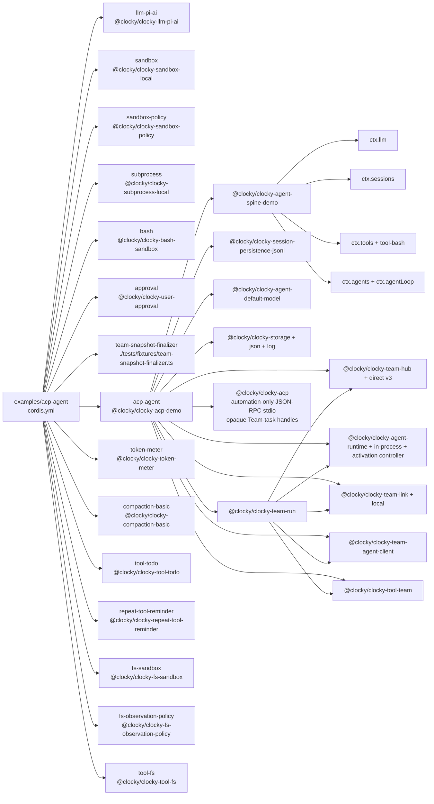

<!-- Generated by scripts/gen-doc-graphs.ts - do not edit by hand.
     Run `pnpm run gen-doc-graphs` to regenerate. -->

# ACP Automation App Composition

The ACP demo exposes TeamRun-backed tasks to programmatic clients over JSON-RPC stdio, with no stdout logger or human UI.

| Plugin id | Package / module |
| --- | --- |
| `llm-pi-ai` | `@clocky/clocky-llm-pi-ai` |
| `sandbox` | `@clocky/clocky-sandbox-local` |
| `sandbox-policy` | `@clocky/clocky-sandbox-policy` |
| `subprocess` | `@clocky/clocky-subprocess-local` |
| `bash` | `@clocky/clocky-bash-sandbox` |
| `approval` | `@clocky/clocky-user-approval` |
| `team-snapshot-finalizer` | `./tests/fixtures/team-snapshot-finalizer.ts` |
| `acp-agent` | `@clocky/clocky-acp-demo` |
| `token-meter` | `@clocky/clocky-token-meter` |
| `compaction-basic` | `@clocky/clocky-compaction-basic` |
| `tool-todo` | `@clocky/clocky-tool-todo` |
| `repeat-tool-reminder` | `@clocky/clocky-repeat-tool-reminder` |
| `fs-sandbox` | `@clocky/clocky-fs-sandbox` |
| `fs-observation-policy` | `@clocky/clocky-fs-observation-policy` |
| `tool-fs` | `@clocky/clocky-tool-fs` |

Source config: [`examples/acp-agent/cordis.yml`](cordis.yml).

Maintenance mode: hybrid: the leaf plugin list is parsed from its `cordis.yml`; app package expansion is curated from package source.
